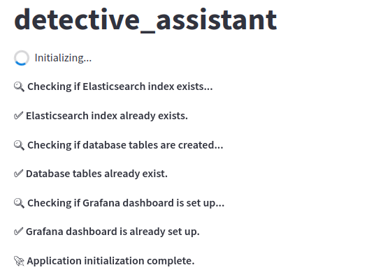
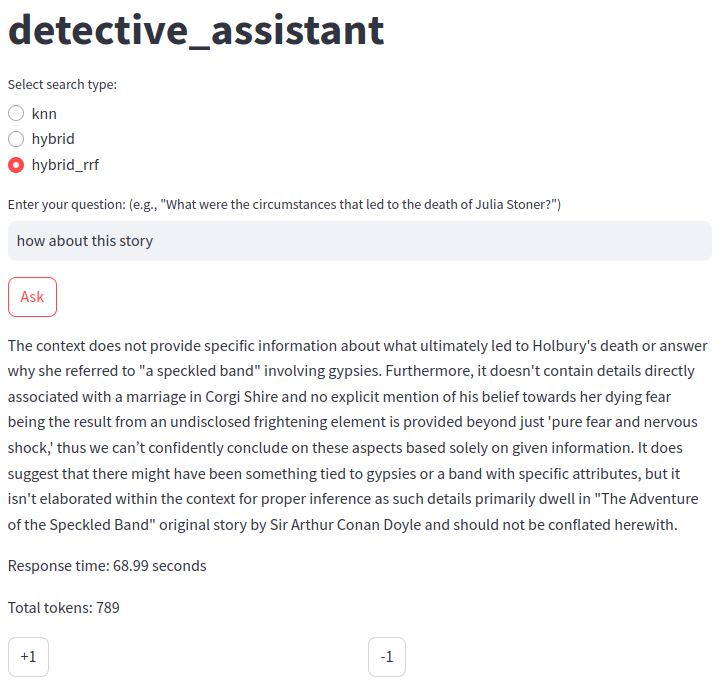

# llm_zoomcamp_project_2024

## Table of Contents

- [Project Overview](#project-overview)
- [Requirements](#requirements)
- [Components](#components)
- [Features](#features)
  - [RAG](#rag)
  - [Dashboard](#dashboard)
  - [Manual Script Execution](#manual-script-execution)
  - [Retrieval Evaluation](#retrieval-evaluation)
  - [Rag Evaluation](#rag-evaluation)
- [Todo](#todo)

## Project Overview
This project uses a short detective story as a knowledge base, allowing users to ask questions and get answers using RAG (Retrieval-Augmented Generation) techniques.

## Requirements
- GitHub Codespaces:
  - Machine type: `4-core 16GB RAM`
  - `Docker 27.0.3-1`
  - `Python 3.12.1` (optional, needed only for manual script execution)
- Gemini API key (optional, free, for evaluation)
- Colab account (optional, for using notebooks)

## Components
- Dataset: [The_Adventure_of_the_Speckled_Band.txt](https://en.wikisource.org/wiki/The_Adventures_of_Sherlock_Holmes_(1892,_US)/The_Adventure_of_the_Speckled_Band)
- Knowledge base: `Elasticsearch`
- LLM: `ollama phi3`
- Embedding model: `all-mpnet-base-v2`

## Features

#### RAG
- Start containers:
  ```
  docker compose up
  ```
- Access the Streamlit app (`localhost:8501`).
- The app automatically:
  - Creates Elasticsearch index (if needed)
  - Creates database tables (if needed)
  - Sets up Grafana dashboard (if needed)
    
  
- Once initialized, you can:
  - Select search type (`Select search type:`)
  - Ask your question (`Enter your question:`)
  - Click `Ask` to perform the RAG query (> 30s for response)
  - Provide feedback with `+1` or `-1`
  
  

#### Dashboard
Access Grafana dashboard (`localhost:3000`), default login: admin/admin.
- **Last 5 Conversations (Table Panel):** Lists the last five conversations with timestamps, questions, and answers.
- **Feedback Summary (+1/-1 Pie Chart):** Displays user feedback with counts of positive and negative responses.
- **Tokens (Time Series Panel):** Tracks total token usage over time.
- **Search Type Distribution (Bar Chart Panel):** Shows the frequency of different search types.
- **Response Time (Time Series Panel):** Monitors response times to assess performance.


#### Manual Script Execution
Optional, since the Streamlit app automates these tasks.
- Install Python packages:
  ```
  pip install -r requirements.txt
  ```
- Ingest data:
  - Load text file
  - Chunk text
  - Embed chunks
  - Create Elasticsearch index
  ```
  docker compose up -d elasticsearch
  python ingest.py
  ```
- Initialize database: create database tables
  - `conversations`: RAG query results and metadata
  - `feedback`: User feedback scores
  - `keyvalues`: Internal storage for Grafana API key
  ```
  docker compose up -d postgres
  python init_db.py
  ```
- Set up Grafana:
  - Generate API key
  - Configure datasource
  - Create dashboards
  ```
  docker compose up -d postgres grafana
  python init_granafa.py
  ```

#### Retrieval Evaluation
Evaluate and compare text (keyword) search vs. vector (semantic) search.
- Metrics: Hit Rate (HR), Mean Reciprocal Rank (MRR)
  ```
  text: (HR, MRR) = (0.742, 0.606)
  vector: (HR, MRR) = (0.762, 0.610) <- better
  ```
- ground_truth_data.ipynb: <a href="https://colab.research.google.com/github/spencer18001/llm_zoomcamp_project_2024/blob/main/ground_truth_data.ipynb" target="_parent"></a>
  - optional, can directly load `ground-truth-data.csv`
  - Use Gemini API to generate five related questions for each document.
  - Outputs `ground-truth-data.csv`.
- eval_retrieval.py: evaluation
  ```
  pip install -r requirements.txt
  docker compose up -d elasticsearch
  python eval_retrieval.py
  ```

#### Rag Evaluation
Evaluate 2 prompts, using Gemini as a relevance judge.
- relevance results
  - prompt: <- better
  ```
  Relevance      Count
  --------------------
  NON_RELEVANT       8
  RELEVANT           6
  PARTLY_RELEVANT    6
  ```
  - prompt2:
  ```
  Relevance      Count
  --------------------
  NON_RELEVANT      11
  PARTLY_RELEVANT    5
  RELEVANT           4
  ```
- llm_results.py:
  - optional, can directly load `llm-results-prompt.csv`、`llm-results-prompt2.csv`
  - Perform rag queries for each prompt, then output results to `llm-results-prompt.csv`、`llm-results-prompt2.csv`.
  ```
  pip install -r requirements.txt
  docker compose up -d elasticsearch ollama
  python eval_rag.py
  ```
- eval_rag.ipynb: <a href="https://colab.research.google.com/github/spencer18001/llm_zoomcamp_project_2024/blob/main/eval_rag.ipynb" target="_parent"></a>
  - Use Gemini api to evaluate the relevance of RAG results for two prompts in relation to the questions.

## Todo
- [x] Problem description (2 points)
- [x] RAG flow (2 points)
    - knowledge base: elasticsearch
    - LLM: ollama phi3
- [x] Retrieval evaluation (2 points)
    - text/vector search
    - metrics: hit_rate, mrr
- [x] RAG evaluation (2 points)
    - 2 prompts, use Gemini as a judge
- [x] Interface (2 points)
    - UI: Streamlit
- [x] Ingestion pipeline (2 points)
    - python script: ingest.py
- [x] Monitoring (2 points)
    - user feedback
    - 5 panels of the dashboard
- [x] Containerization (2 points)
    - elasticsearch、ollama、postgres、grafana、streamlit
- [x] Reproducibility (2 points)
- Best practices
    - [x] Hybrid search: search_type `hybrid` (1 point)
    - [x] Document re-ranking: search_type `hybrid_rrf` (1 point)
    - [ ] User query rewriting (1 point)
- [ ] Bonus points (not covered in the course)
    - Deployment to the cloud (2 points)
